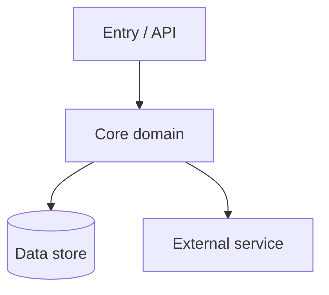

# Code Tour

Produce `CODE_TOUR.md` — a concise onboarding guide that a new engineer can read
in a few minutes to understand an unfamiliar codebase: what it is, the handful of
components that matter, a diagram of how they connect, and the spots that are
worth a closer look.

## When to Use This Skill

Use this skill when the user requests:
- "Code tour" / "tour this codebase" / "give me a tour"
- "Onboard me to this repo" / "help me understand this codebase"
- "Explain this codebase" / "what's the architecture here"
- "/code-tour"

It is read-mostly: it explores the code and writes exactly one artifact
(`CODE_TOUR.md` at the repo root by default). It does **not** modify source code.

**Argument (optional).** `/code-tour [path-to-tour]` scopes the tour to a
subdirectory or package (write `CODE_TOUR.md` inside it). With no argument, tour
the whole repo from its root.

## Guiding Principles

- **Concise over complete.** A tour is a map, not the territory. Target the
  ~5–9 components that actually matter. A wall of detail is worse than a sharp
  one-pager — if the reader wanted everything, they'd read the source.
- **Ground every claim.** Point to real files with `path/to/file.ts:42`
  breadcrumbs (clickable in most editors/terminals). Never describe code you
  have not opened. If you are unsure, say so in "Worth investigating" rather
  than guessing.
- **Newcomer's-eye view.** Explain the *why* and the *shape*, not line-by-line
  mechanics. Assume a competent engineer who has never seen this repo.

---

## Phase 0 — Orient

Build a cheap mental model before reading deeply:

1. Read `README*`, `CONTRIBUTING*`, and any top-level docs.
2. Read the package manifest(s) to learn the language, framework, and scripts:
   `package.json`, `pyproject.toml` / `requirements.txt`, `go.mod`, `Cargo.toml`,
   `pom.xml` / `build.gradle`, `Gemfile`, etc.
3. Detect entry points and runtime shape:
   - `bin`/`main`/`scripts` fields, `Dockerfile`, `Procfile`, `*.service`
   - server bootstrap (`main.*`, `index.*`, `app.*`, `cmd/`), CLI entry, or
     library root.
4. Get a sense of scale and layout:
   ```bash
   git ls-files | sed 's#/.*##' | sort | uniq -c | sort -rn | head -20   # top-level dirs by file count
   git ls-files | wc -l                                                   # total tracked files
   ```
5. Note the build/test/run commands a newcomer would need.

If the repo is tiny (a few dozen files), skip the fan-out in Phase 1 and read it
directly.

## Phase 1 — Map the codebase (parallel Explore agents)

For anything non-trivial, launch **Explore agents in parallel** to gather ground
truth quickly. Give each a narrow lens and ask for `file:line` evidence. Adapt
the set to the project; skip lenses that don't apply.

- **Entry & runtime agent:** What starts the program? Trace from entry point to
  the first meaningful work. What are the top-level commands/routes/CLI verbs?
- **Core domain agent:** What are the main modules/packages and each one's
  responsibility? Which are central vs. peripheral? Where does the core business
  logic live?
- **Data & state agent:** Models/schemas, database/ORM, migrations, caches,
  in-memory state, external persistence. How does data flow in and out?
- **Integrations agent:** External services, APIs, queues, auth providers, env
  vars/config, third-party SDKs. Where are the system's edges?
- **Build/test/ops agent:** Build pipeline, test layout and coverage gaps, CI,
  deploy config, feature flags. How is this thing shipped?

Each agent should return: the key files (with line numbers), each component's
one-line responsibility, and what it connects to.

## Phase 2 — Find the spine

From the agents' findings, decide:
- The **5–9 components** that a newcomer must understand. Merge trivia; cut the
  rest. Err toward fewer.
- The **dependency/data-flow edges** between them (who calls/imports/feeds whom).
- **One representative end-to-end path** (e.g. a request, a CLI command, a job)
  to narrate as a concrete walkthrough.

## Phase 3 — Note what helps a newcomer read the code

This is **not** a code review or a problem hunt. The goal is to orient a new
reader to the codebase *as it is* — where to focus, which conventions to follow,
and what isn't obvious from any single file. Stay descriptive, not evaluative;
cite locations.

- **Where the weight is** — the largest, most-central, and most-churned areas.
  These are where a newcomer will spend their time, so point them out.
- **Conventions & patterns** — the idioms the codebase follows so the reader can
  read *with the grain*: naming, layering, error handling, how state flows, and
  the standard way a new feature / module / route / test gets added.
- **Non-obvious wiring** — behavior you can't discover from one file: codegen,
  dependency injection, config- or convention-driven dispatch, framework
  "magic," global state, implicit contracts between modules.
- **Open questions** — parts whose purpose isn't clear from the code alone. Note
  them as "read closely / ask a teammate," not as defects, so the reader knows
  where to dig.

```bash
git ls-files -z | xargs -0 wc -l 2>/dev/null | sort -rn | head -15   # where the mass is (largest files)
git log --since='6 months ago' --name-only --pretty=format: | sort | uniq -c | sort -rn | head -15   # where the action is (most-changed files)
```

## Phase 4 — Write CODE_TOUR.md

Write to `CODE_TOUR.md` at the repo root (unless the user specified another
path). Use the skeleton below. Keep prose tight — aim for roughly 150–400 lines
depending on repo size. Drop any section that doesn't earn its place.

````markdown
# Code Tour: <project name>

> Onboarding map of this codebase. Generated <YYYY-MM-DD>. Read top to bottom.

## What this is
1–3 sentences: the project's purpose, who uses it, the problem it solves.

## Stack & how to run it
- **Language / runtime:** …
- **Framework / key libraries:** …
- **Package manager:** …
- **Run / test / build:**
  ```
  <commands a newcomer needs>
  ```
- **Entry point(s):** `path/to/entry.ext:NN`

## The big picture

2–4 sentences walking the reader through the diagram above.

## Key components
<5–9 entries. One short block each.>

### <Component name> — `path/to/dir-or-file`
- **Does:** one-line responsibility.
- **Start here:** `path/file.ext:NN`
- **Connects to:** <other components>.

## A walk through one flow
Trace a single representative path end-to-end, with breadcrumbs:
`entry.ext:NN` → `handler.ext:NN` → `service.ext:NN` → `store.ext:NN`.
2–5 sentences on what happens at each hop.

## Worth a closer look
<Pointers that help a newcomer understand the code — not a defect list.>
- 🧭 **<convention / pattern>** — the idiom to follow when working here. (`path/file.ext:NN`)
- 🔍 **<open question>** — what isn't obvious from the code, and where to look or who to ask. (`path/file.ext:NN`)

## Glossary
<Only domain terms a newcomer won't know. Omit if none.>
- **<term>** — plain-language definition.

## Where to go next
Suggested reading order for someone joining: 1) … 2) … 3) …
````

## Phase 5 — Verify before finishing

- Every `file:line` reference points at a real, currently-existing location.
- The Mermaid block is valid (balanced brackets, no stray characters in node
  labels — wrap labels containing special characters in quotes).
- Component count is in the 5–9 range; trim if it ballooned.
- No invented behavior: each claim traces to something you actually read.

Then tell the user where the file was written and give a 2–3 sentence summary of
what the tour found (the spine, plus the one thing most worth knowing before
diving in).

## Notes

- **One artifact only.** Don't scatter notes across files; everything lands in
  `CODE_TOUR.md`.
- **Re-running:** if `CODE_TOUR.md` already exists, treat it as a draft to refresh
  rather than blindly overwriting — preserve any human edits you can identify.
- **Monorepos:** if the repo is clearly several apps/packages, ask whether to tour
  the whole repo or one package, and scope the entry points accordingly.
- **Diagrams:** prefer one clear `graph TD` over several busy diagrams. Add a
  `sequenceDiagram` only if a single flow genuinely needs it.
- This skill is descriptive, not evaluative — it explains the codebase as it is,
  not what's wrong with it or how to change it. If the user wants a critique or a
  cleanup, point them to a dedicated review (e.g. `/review-code`,
  `/quality-dead-code-analyzer`) as a separate step.
